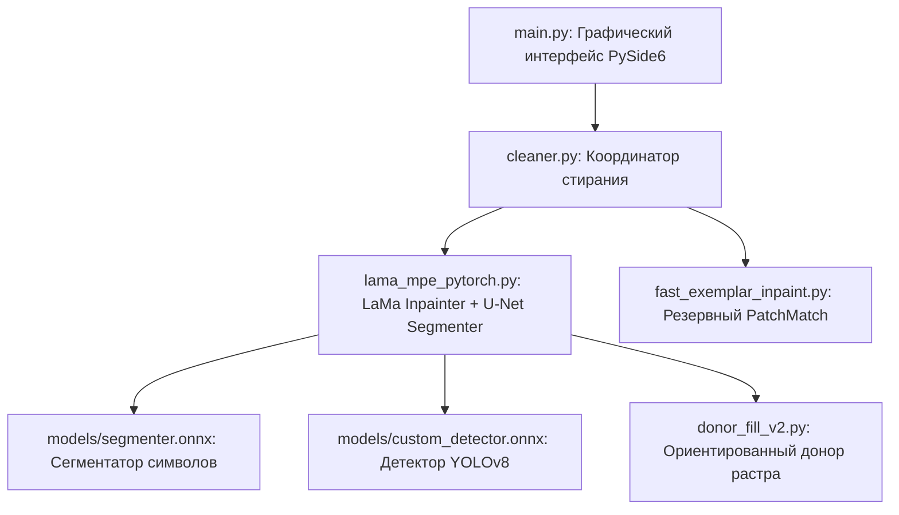

# 🗺️ MangaEditor: Архитектурная карта и инструкция по передаче проекта

## 📌 Общий обзор репозитория
* **Репозиторий**: `https://github.com/KARAPUZ1226/MangaEditor.git`
* **Основа приложения**: PySide6 / OpenCV / PyTorch / ONNX Runtime.
* **Главный вход**: `main.py`
* **Назначение**: Автоматическое и ручное стирание японского/английского текста в манге с сохранением скринтонов, текстур, контуров рисунка и одежды.

---

## 🏗️ Архитектура и структура модулей



### 1. `main.py` — Главный GUI-интерфейс
* **Назначение**: Графическая оболочка приложения на PySide6.
* **Связи**: Вызывает [cleaner.py](file:///D:/Hren%20kakaya-to/MangaEditor/cleaner.py) для обработки выделенных пользователем областей (баблов).

### 2. `cleaner.py` — Координатор инпейнтинга
* **Назначение**: Принимает вызов выделения (прямоугольник `rect`), подготавливает кропы кадра `512x512` и передает управление модельному инпейнтеру.
* **Связи**: Передает данные в [lama_mpe_pytorch.py](file:///D:/Hren%20kakaya-to/MangaEditor/lama_mpe_pytorch.py).

### 3. `lama_mpe_pytorch.py` — Конвейер LaMa + U-Net Сегментатор
* **Назначение**: Выполняет глубокую нейросетевую обработку кадра.
* **Модели**:
  * `models/segmenter.onnx` — обученная пользовательская U-Net модель сегментации символов. Принимает патчи `256x256`.
  * `models/inpainting_lama_mpe.ckpt` — модель LaMa (Fourier Inpainting).
* **Связи**: Для восстановления растрового скринтона вызывает [donor_fill_v2.py](file:///D:/Hren%20kakaya-to/MangaEditor/donor_fill_v2.py).

### 4. `donor_fill_v2.py` — Ориентированное заполнение растра (Donor Screentone)
* **Назначение**: Восстановление растровых точек (halftone dots) в зонах стертого текста.
* **Алгоритм**:
  1. Вычисляет вектор доминирующего сдвига растровой сетки `(dy, dx)`.
  2. Выполняет двунаправленный забор чистых растровых точек из оригинального кадра.
  3. Накладывает 4px Distance Transform градиент (`feather_blend_patch`) по краям маски.

---

## 🛠️ Инструкция по запуску и передаче проекта

### 1. Окружение и зависимости
Рекомендуется использовать Python 3.10+ и виртуальное окружение:
```bash
# Создание виртуального окружения
python -m venv venv

# Активация окружения (Windows PowerShell)
.\venv\Scripts\Activate.ps1

# Установка зависимостей
pip install -r requirements.txt
```

### 2. Запуск приложения
```bash
python main.py
```

### 3. Ключевые файлы моделей (в папке `models/`)
* `models/segmenter.onnx` — U-Net сегментатор текста (вход: `[1, 1, 256, 256]`).
* `models/inpainting_lama_mpe.ckpt` — веса модели LaMa.
* `models/custom_detector.onnx` — YOLOv8 детектор текста.

---

## 🎯 Известные моменты для следующего разработчика
1. **Зона поиска маски в `lama_mpe_pytorch.py`**:
   * Для поиска символов используется скользящее окно 256x256 со страйдом 128 без сжатия пропорций.
   * При выделении бабла область расширяется по горизонтали на `+130px`, чтобы захватывать соседние буквы.
2. **Сегментация U-Net**:
   * Модель возвращает вероятности `crop_probs`. Порог вероятности настроен на `0.20` с ядром дилатации `5x5` (2 итерации).
